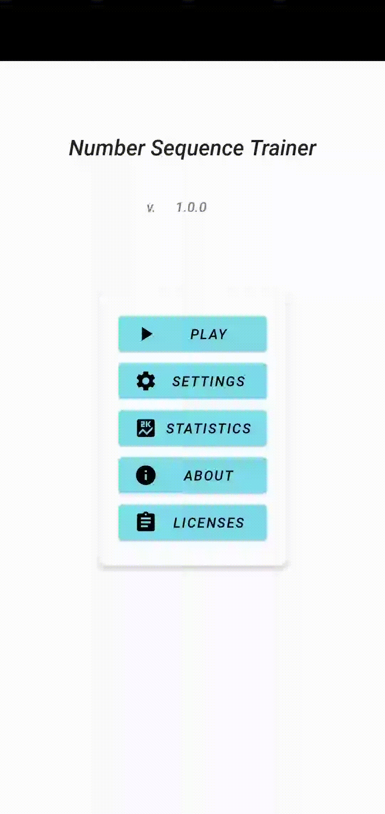

# Number Sequence Trainer
[](https://github.com/achawki/number-sequence-trainer-android/blob/master/LICENSE)

*Practise number sequences. The `Number Sequence Trainer` will generate sequences randomly*. 



## Play Store

Soon to come

## Features

- Support for dark mode
- Different difficulties
- User statictics
- Support for English and German
- No internet access required (data is only stored locally)


## Build APK

1. Clone the project
```
git clone https://github.com/achawki/number-sequence-trainer-android
```
2. Build (or import into [Android Studio](https://developer.android.com/studio/))
```
./gradlew assemble
```

3. APK can be found in `./app/build/outputs/apk/`

## Running tests

```
./gradlew test
```

Run instrumentation tests on a connected device

```
./gradlew connectedAndroidTest
```

